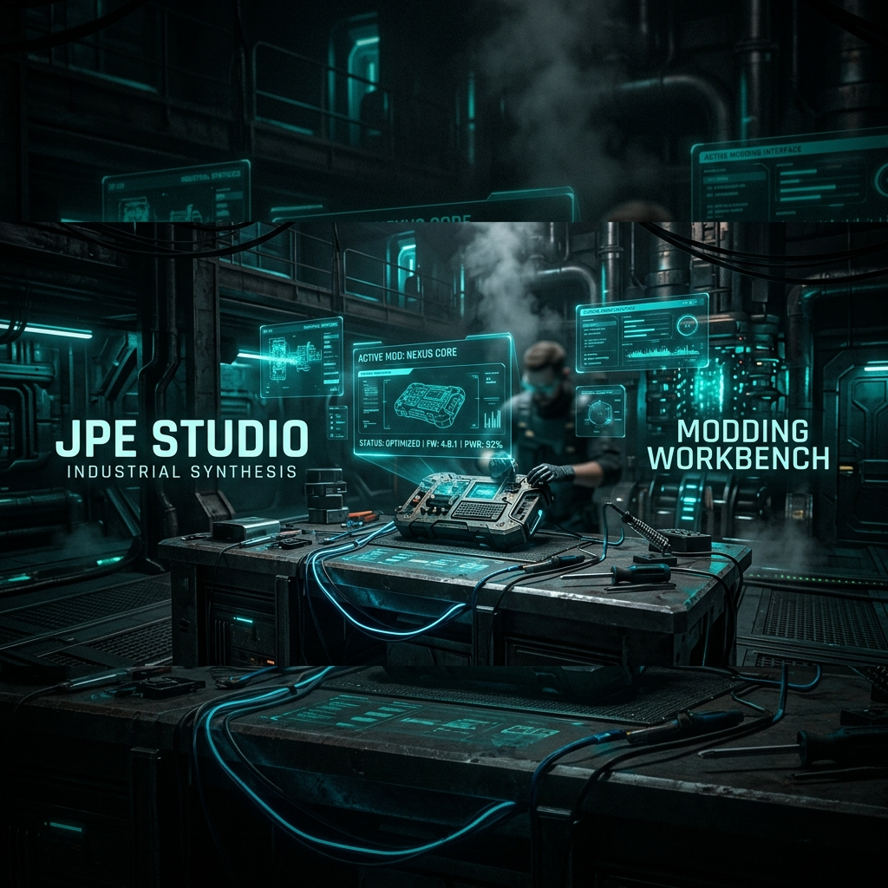
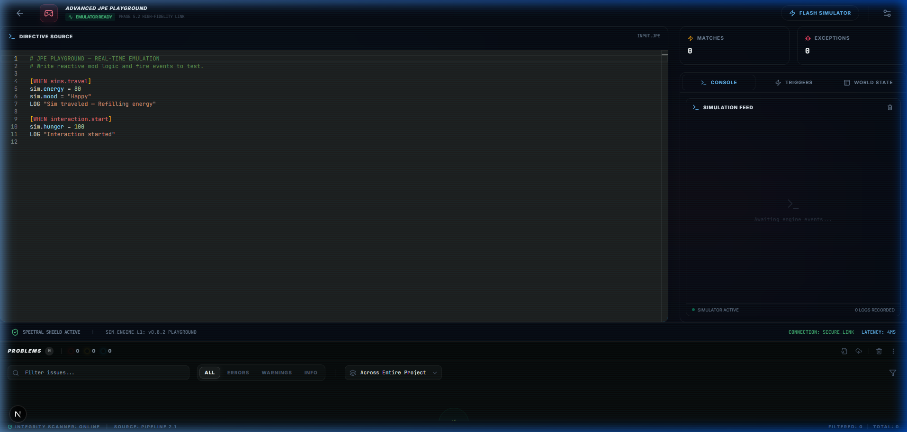
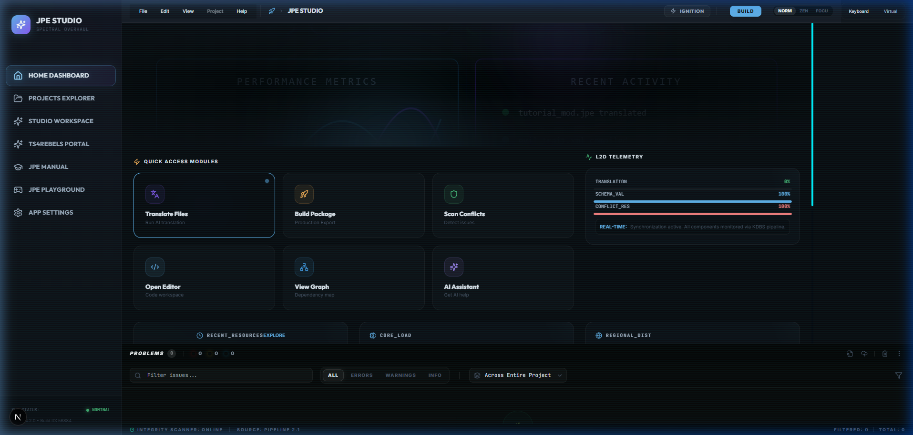

# JPE Studio 2.1: The Professional Sims 4 Modding Environment

### Clarity in every line. Precision in every pulse.

JPE Studio 2.1 is an industrial-grade IDE designed to bridge the gap between complex Sims 4 technical infrastructure and creative intuition. Powered by the **Just Plain English (JPE)** translation engine and the **Spectral** design system, it transforms modding into a high-fidelity, sensory-rich experience.

---

## 🏗️ The Expert's Toolkit (Meet Alex)

> *"When I'm deep in a 50MB script mod, I don't need abstractions—I need transparency. JPE Studio's Workbench mode is my mission control."*

- **Industrial JPE Grammar**: Logic-first modding that strips away the opaque XML to reveal pure, human-readable directives.
- **Local AI Autonomy**: Fully sandboxed, offline-first intelligence distribution. No cloud dependencies; just raw, local model power.
- **Shielded Handshake**: Hardware-bound AES-256-GCM vault derivation ensures your modding environment and AI configurations are cryptographically sealed to your device.
- **Spectral Diagnostics**: Real-time bioluminescent state indicators monitor engine health and integrity with zero-latency feedback.

---

## ✨ The Beginner's Bridge (Meet Maya)

> *"I used to be terrified of breaking my game. Now, modding feels like just reading a book. The 'Aha!' moment is real."*

- **The "Aha!" Translation**: Instantly see what a mod does before you touch it. JPE translates complex XML tags into simple English sentences.
- **Zen Studio HUD**: Reduce technical fatigue with a minimalist interface that strips away the noise, leaving only the glowing path to creativity.
- **Technical Ignition**: A celebratory, verbose boot sequence that explains exactly what's happening under the hood, making technology feel inclusive, not intimidating.
- **One-Click Deployment**: JPE-Live bridge synchronizes your work directly with The Sims 4 in real-time.

---

## 🎮 Handheld Studio (Meet Chris)

> *"Modding on a train used to be impossible. Now, my Steam Deck is a fully-fledged modding workstation."*

- **Focus Mode (1280x800)**: Specialized resolution logic that chunky-fies the HUD for the Steam Deck screen.
- **Chorded Controller Input**: Native controller navigation with haptic telemetry (Steam Input) providing tactile heartbeat status for ingestion and builds.
- **Low-Energy Synthesis**: Preserves battery life while maintaining the high-fidelity Spectral aesthetic.

---

## 🛠️ Industrial Specification

- **Engine**: NEXT.js + Electron (Hardened IPC)
- **Intelligence**: Local GGUF / Ollama (Sandboxed)
- **Security**: Hardware-Bound AES-256 Vault
- **Aesthetic**: Spectral Design System (Teal-Focus)
- **Platform**: Windows / SteamOS (Steam Deck Native)

---

## 🍱 Steam Deck Library Assets

We've provided high-fidelity custom assets for your Steam Library. Find them in the `docs/assets/steam/` folder.

| Capsule (Vertical) | Library Hero (Wide) |
| :--- | :--- |
|  |  |

---

### **Synthesis Complete.** JPE Studio 2.1 is RC1 Ready.
建设